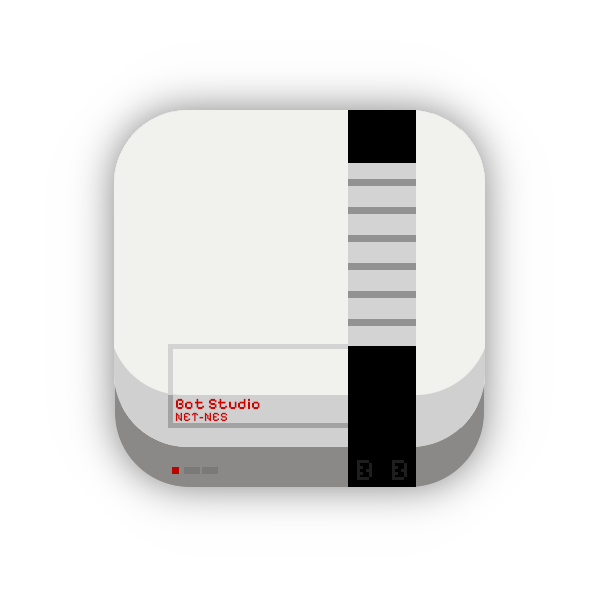
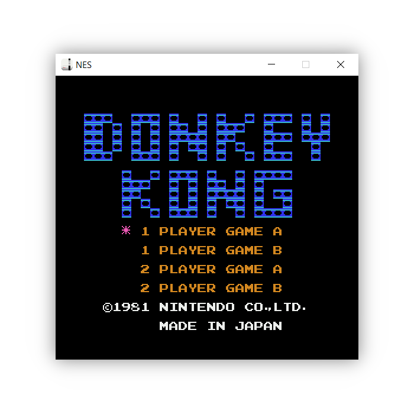
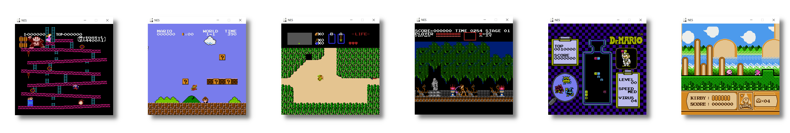
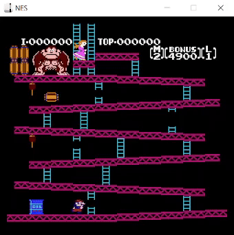
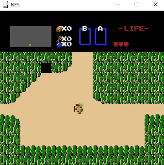
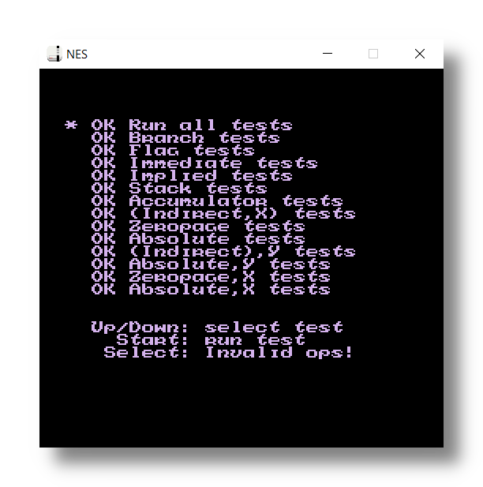

<!-- PROJECT LOGO -->
<h1 align="center">
  <br>
  <a href="https://github.com/BotRandomness/NET-NES"></a>
  <br>
  <b>NET-NES</b>
  <br>
  <sub><sup><b>NET-NES, a NES emulator, written in C#.</b></sup></sub>
  <br>

</h1>

<p align="center">
  <a href="https://github.com/BotRandomness/NET-NES">
      
  </a>
</p>

<p align="center">
<strong>NET-NES is a NES emulator, capable of running some of the best games for the NES.</strong> <em>To start off</em>, after making my Gameboy emulator, <a href="https://github.com/BotRandomness/CODE-DMG">CODE-DMG</a>, I wanted to create the next step up. As I thought to myself, <strong>"It only made sense to create a NES emulator!"</strong> It felt such a natural pairing making a Gameboy emulator, and now NET-NES, a NES emulator. The NES to me is a very fascinating console. The NES not only made a impact in gaming history, but also in electronics, which captivated me. Not to mention how the NES is home to some of the best and well known games! So why not take on the <strong>challenge</strong> and emulate it, it would be perfect! Now, <em>some quick history and background information.</em> The NES, <em>(Nintendo Entertainment System)</em>, launched first in Japan as the <strong>FamiCom</strong> <em>(Family Computer)</em> in <strong>1983</strong>, later coming into <strong>North America in 1985</strong>. At this point in North America, the <em>Video Game Crash of 1983</em> was hitting North America hard, with home console gaming market being in shambles. However, <strong>Nintendo</strong> in 1985 decided to launch their console in North America, change the name to NES, advertise it as a "toy", and <strong>boom!</strong> That was able to <strong>bring life back</strong> into the gaming industry in North America! Pretty cool history if I say so myself. Now into the hardware itself, the NES houses a <strong>8-bit CPU</strong>, a <strong>Ricoh 2A03</strong>, which runs at around <strong>1.79 Mhz</strong>. This CPU is pretty much a clone of the <strong>MOS 6502</strong>, but with the <strong>decimal mode removed, and a APU added</strong>. The <strong>PPU</strong>, the <strong>Ricoh 2C02</strong>, runs around <strong>3 times faster then the CPU</strong>, and is reponsible for display graphics on a frame of <strong>256x240</strong> with palletes being able to pick from <strong>64 colours</strong>. When it comes to <strong>memory</strong>, there is <strong>2 KB of RAM</strong>, and <strong>2 KB of VRAM</strong> with a <strong>16-bit address bus</strong>. NES cartridges can also contain a <strong>mapper chip</strong> to support larger ROMs, larger graphics data, and more RAM. Coming back to this project, this was really fun to work on! Now you may have a few questions like, <em>"Ok, so why the name NET-NES?"</em> Well I made it using C# and Dotnet, so I thought it's <strong>pretty unique and fun to say!</strong> Now you may ask, <em>"Cool, but why C# and Raylib again? Why not C/C++, or even Java?"</em> <strong>C# has been was wonderful to use</strong> and something I keep coming back to, and the <strong>community is great</strong>. As for Raylib, <strong>I just keep finding it fun! :)</strong>
</p>

</div>

<!-- ABOUT THE PROJECT -->

## Getting Started
Want to use it, and mess around? Here's how you can get started! </br>

### Download
1. Download it from [here](https://github.com/BotRandomness/NET-NES/releases), or on the releases page. (win-x64, win-x86, osx-x64, osx-arm64, linux-x64)
2. Unzip the folder
3. Launch the executable
   - On MacOS, there might be a pop up saying "Apple could not verify", this is normal. Simply right click on the app, then open, then open again. You also go to System Settings, then security, then allow. You only need to do this once during the first time. 
   - You may also need to enable execute permission on "Unix-like Oses"
   - If you want to use the <strong>terminal</strong>: Point your terminal to the application and run, Windows: `NET-NES --nes <string:rom>`, Unix-like Oses `./NET-NES --nes <string:rom>`
4. You are ready to go!

### Controls
- (A) = X
- (B) = Z
- [START] = [ENTER]
- [SELECT] = [RSHIFT]
- D-Pad = ArrowKeys

<em>Note: Pressing [SPACE] Bar toggles the top menu bar.</em>
### Usage
Simply launching the executable will show the basic GUI. Going `File -> Open ROM` will bring up a file launcher to select your ROM. `Help -> Manual` will show all the basic instructions on how to use, and what to know. More information in the Compatibility section.
#### Flags
NET-NES flags when using terminal. Note: these flags can be passed in any order, and in any combination.
- `--nes <string:path>`: Starts up the emulator given a rom file
- `--json <string>`: Runs a CPU test for a instruction given a JSON file in test/v1
- `-s <int>`, `--scale <int>`: Scale window size by factor (2 is default)
- `-f`, `--fps`: Enables FPS counter (off is default)
- `-rl`, `--raylib-log`: Enables Raylib logs (off is default)
- `-d`, `--debug`: Enables debug mode (off is default)
- `-a`, `--about`: Shows about
- `-v`, `--version`: Shows version number
- `-h`, `--help`: Shows help screen

## Screenshots
<a href="https://github.com/BotRandomness/NET-NES">
    
</a>
<p align="center"> Showcase of running games </p>

### Demo Gameplay
<table>
    <tr>
        <td><a href="https://github.com/BotRandomness/NET-NES"></a></td>
        <td><a href="https://github.com/BotRandomness/NET-NES"></a></td>
    </tr>
  <tr>
        <td><a href="https://github.com/BotRandomness/NET-NES"></a></td>
        <td><a href="https://github.com/BotRandomness/NET-NES"></a></td>
    </tr>
  <tr>
        <td><a href="https://github.com/BotRandomness/NET-NES"></a></td>
        <td><a href="https://github.com/BotRandomness/NET-NES"></a></td>
    </tr>
  <tr>
        <td><a href="https://github.com/BotRandomness/NET-NES"></a></td>
        <td><a href="https://github.com/BotRandomness/NET-NES"></a></td>
    </tr>
  <tr>
        <td><a href="https://github.com/BotRandomness/NET-NES"></a></td>
        <td><a href="https://github.com/BotRandomness/NET-NES"></a></td>
    </tr>
</table>

## Compatibility
<p align="center">
  <a href="https://github.com/BotRandomness/NET-NES">
      
  </a>
</p>
<p align="center">Passes nestest CPU instruction tests</p>
Most NES cartridges came with a mapper chip to support larger size of ROM and graphics data, as well as bulit in RAM on the cartridges. Mapper 0 (NROM) is most simple, and should work. Mapper 1, Mapper 2, and Mapper 4 all have been implemented and they work, but they should be consider experimental.</em>

</br>

Most games I tried out works. Some games may have some graphical glitches, or might just freeze. This is because even though I have emulated the base NES system, the emulation itself is not fully accurate. This because the PPU emulation I did runs by scanline timing, and not by dot by dot, meaning there is some timing inaccuracy that can effect a few games. More infomation in the Program Architecture section. However, most games should run fine, here is list of games I tested:
```
Balloon Fight - Works
Bubble Bobble - Works
Castlevania - Works
Castlevania II - Works
Contra - Works
Donkey Kong - Works
Dr. Mario - Works
DuckTales - Works
Execitebike - Works
Final Fantasy - Works
Final Fantasy II - Freeze at first Battle (Due to inaccurate Sprite0 Hit timming)
Final Fantasy III - Works
Galaga - Works
Ice Climber - Works
Kirby's Adventure - Works
The Legend of Zelda - Works
Mario Bros. - Works
Mega Man - Works
Mega Man 2 - Works
Mega Man 6 - Works
Metroid - Works
Ninja Gaiden - Freeze at Act 1 Screen (Due to inaccurate Sprite0 Hit timming), However you can get it to work if in debug mode you disable "Sprite0 Hit Check"
Ninja Gaiden II - Works
Ninja Gaiden III - Works
Pac-Man - Works
Super Mario Bros. - Works
Super Mario Bros. 2 - Works
Super Mario Bros. 3 - Works
Teenage Mutant Ninja Turtles Tournament Fighters - Works
Tetris - Works
Tetris 2 - Works
```

## Compile
Want to tinker around, modify, make your own, learn a bit about emulation development, or contribute? Here's how you can get started with the code and compile.

To get started, you need to have dontnet install. For reference, I used dotnet 6.0

1. Download dotnet: https://dotnet.microsoft.com/en-us/
2. Clone this repository, and point your terminal to the root directory of the repository
3. Run `dotnet run` to compile, and it should run right after! You also do `dotnet run -- --nes <string:rom>` if want to load up a rom at startup!

Raylib-cs (the C# binding (made by Chris Dill) for Raylib), does not need to be installed, as dotnet will automatically install any dependences from NuGet. For more information on raylib-cs can be found here on Github: https://github.com/chrisdill/raylib-cs. This also applies to [Rlimgui-cs](https://github.com/raylib-extras/rlImGui-cs) and [ImGui.NET](https://github.com/ImGuiNET/ImGui.NET).

### Build
- For your own platform, framework dependent: `dotnet publish`
- For other platform, single file, not framework dependent:</br> `dotnet publish -r <RID> --self-contained -o bulid/<RID-Name> /p:PublishSingleFile=true`
- For other platform, single file, framework dependent:</br> `dotnet publish -r <RID> --no-self-contained -o bulid/<RID-Name> /p:PublishSingleFile=true`
</br>
The reason to have both dotnet dependent or not is the file size. If the user already has dotnet, the lighter file size is the best option. If the user does not have dotnet, it's more convenient to bundle in the dotnet as self contained even if the file size is larger. It's best to put PublishSingleFile for convenience, especially for self contained dotnet as that will have 224 dll files all in the root of the executable.
</br></br>
For more see the dotnet publish documentation: https://learn.microsoft.com/en-us/dotnet/core/tools/dotnet-publish, RID: https://learn.microsoft.com/en-us/dotnet/core/rid-catalog, SingleFile: https://github.com/dotnet/designs/blob/main/accepted/2020/single-file/design.md </br> </br>

For <strong>MacOS</strong>, building requires signing, <em>especially for Apple Silicon</em>. This part is going to be a general note. Dotnet and C# when running and building will automatically sign the binaries with a simple "ad-hoc" (meaning needed or for this) signature. This needs to be done for using and distributing. On other platforms, compiling for Macs would not be signed, since Apple's `codesign` tool is only on Macs <em>(though others have made open source versions of the tool for cross-platform use)</em>. If you have a unsigned binary compiled on a non-Mac platform now on a Mac platform, a simple "ad-hoc" signing will do and can done by `codesign -s - <BinaryPath>`. When it comes `.app` bundles, signing is also required in the same way. You can bulid the `.app` bundle manually since it's just a directory (Mac build of NET-NES for reference). However, even if the `.app` bundle is made up with already signed binary, you will have to re-sign the <strong>whole</strong> `.app` bundle. This can be done with `codesign --force --deep -s - <AppPath.app>`. 

### Program Architecture
Here's a little information on the program layout! 

It can seem a bit complex at first, but it's quite simple. I like to write my code, where it should be easy enough for anyone to understand, no matter their knowledge with emulation, or code! With that in mind, this portion itself is written to be simple, no matter your skill level, so anybody should get the idea of the program works, it's sort of the reason why I write these parts! :)

C# object oriented design allows us to think all the componets of the NES hardware, and make them into classes, which can be used to represent a object. The root of the `src` contains all the main code. With that, we have the following:
- `CPU.cs`: The 8-Bit NES CPU (Ricoh 2A03)
- `PPU.cs`: The PPU (Picture Processing Unit) of the NES is responsible for drawing the graphics on screen
- `Bus.cs`: Contains the `Read()` and `Write()` functions, directing bus for RAM, VRAM, and the cartridge, this also there we can "wire up" some our componets here that rely on memory access
- `Cartridge.cs`: Contains memory for PRG and CHR, set's up the cartidge state depending on the iNES header
- `src/mapper`: Contains the different memory bank controllers needed, all to make the NES support larger ROMs
  - `Mapper0.cs`: NROM
  - `Mapper1.cs`: MMC1
  - `Mapper2.cs`: UxROM
  - `Mapper4.cs`: MMC3
- `Input.cs`: Handles input for the NES
- `NES.cs`: Where we "wire up" all the componets
- `Test.cs`: Used for JSON test for the CPU
- `TestBus.cs`: A simplified bus for simple memory access for testing
- `TestRunner.cs`: Runs the JSON test from `Test.cs`
- `GUI.cs`: A simple GUI to wrap the NES core
- `Helper.cs`: Static class to hold global values
- `Program.cs`: The entry point of the emulator

<em>This emulator is <strong>not meant to be cycle accurate</strong>, as the PPU does not run dot by dot, but by scanline.</em>

Each component should stick to it's task. The core of this emulator is written in plain C#, with the only outside library being raylib-cs which is used very minimally. It would be something I may do where I refactor the code to make the core more independent, which should be easy enough to do.

To see how the main loop works, we can look into the `NES.cs` in the `Run()` function: 
```cs
public void Run() {
  int cycles = 0;

  bus.input.UpdateController();

  while (cycles < 29828) {
    int used = bus.cpu.ExecuteInstruction();
    cycles += used;
    bus.ppu.Step(used * 3);
  }

  bus.ppu.DrawFrame(Helper.scale);
}
```
The loop is quite simple, and uses a simple approach of having the "CPU drive". This is done my the CPU's `ExecuteInstruction()` function, where after every instruction, it return it's cycle count. We can pass this count into the PPU's `Step()` function as it's important to keep the CPU and PPU in sync. We do times by three here because the PPU runs 3x faster then the CPU. The PPU's `Step()` function using the cycle count keeps tracks of it's own cycles to perform the correct behaviour at certain cycle threshold. We have this loop run for 29828 cycles, since having 29828 cycles done represent a frame worth of cylces for around 60 FPS (NTSC).

All the other components should follows their own sturucture to do it's job. For example the `CPU` will execute a instruction using the `Bus`, reading the opcode to see what instruction to do, then writing to memory if needed or handle a interrupt. The `PPU` will take in the number of cycles for tracking, and perform certain behaviour such as after cycle relative to scanline, `scanlineCycle >= 341`, it can render a scanline. The `Bus` is what connects the `CPU` and `PPU` to memory, and it's all three components can "talk" to each other using MMIO which are get special places in memory where both componets can read and write depending on use, for example like PPUDATA `$2000` which where VRAM data can we read and write to. Let's look at `CPU.cs` as a example. A constructor is made to set the default state of the componet:
```cs
public CPU(IBus bus) {
     A = X = Y = 0;
     PC = 0x0000;
     SP = 0x0000;
     status = 0;

     this.bus = bus;

     irqRequested = false;
     nmiRequested = false;

     Console.WriteLine("CPU init");
}
```
Notice how other component can rely on others, and how they need to be passed in. In this case of the CPU, the Bus is passed in, as many insturction need to access to the memory. Each component then had the "main" method they would be invoking. For PPU called `Step()` as we step every cycle passed in. For the CPU, we have `ExecuteInstruction()`:
```cs
private byte Fetch() {
  return bus.Read(PC++);
}

public int ExecuteInstruction() {
  ...
  byte opcode = Fetch();

  switch (opcode) {
  //LDA, LDX, LDY, STA, STX, STY
  case 0xA9: return LDR(ref A, Immediate, 2);
  case 0xA5: return LDR(ref A, ZeroPage, 3);
  case 0xB5: return LDR(ref A, ZeroPageX, 4);
  ...

private int LDR(ref byte r, Func<AddrResult> mode, int baseCycles) {
  var addr = mode();
  r = bus.Read(addr.address);
  SetZN(r);

  return baseCycles + addr.extraCycles;
}
```
If you have seen my Gameboy emulator, CODE-DMG, all of this may seem familiar. If you go over each component step by step, it's pretty each to follow along.
## Credits/Resources
NET-NES wouldn't be possible without these resources:
- NESDEV Wiki: https://www.nesdev.org/wiki/Nesdev_Wiki
- 6502 Opcodes: https://www.masswerk.at/6502/6502_instruction_set.html
- Obelisk 6502 Documentation: https://www.nesdev.org/obelisk-6502-guide/
- SingleStepTest JSON Test 65x02: https://github.com/SingleStepTests/65x02
- MOS Microcomputer Programming Manual: https://archive.org/details/mos_microcomputers_programming_manual
- MOS Microcomputer Hardware Manual: https://web.archive.org/web/20221106105459if_/http://archive.6502.org/books/mcs6500_family_hardware_manual.pdf
- Rodrigo Copetti's NES/Famicom Architecture A Practical Analysis: https://www.copetti.org/writings/consoles/nes/

These documentations were so useful, I recommend anyone to use them!
Also shoutout to the EmuDev community! 

## Upcoming Features
- [ ] Debugger
  - VRAM viewer, Memory viewer, step mode
- [ ] Add More Mappers
  - Mapper 3
- [ ] Player 2 Controller Support
- [ ] Audio
- Post any feature request in the Issues tab!

## Known issues
- [ ] Upgrade PPU to dot by dot
  - Will make it more accurate
- [ ] Improve interrupt logic
- If you find other bugs/issues, open up a issue in the Issue tab

## Remarks
What a adventure it was to make Gameboy emulator and a NES emulator back to back. I find hard to believe that a year ago I just finished making my first emulator for the CHIP-8 not knowing anything about low-level hardware, and now after making four emulators <em>(CHIP-8, Intel 8080, Gameboy, NES)</em>, it feels great. As with anything I make, I not only like to share the software itself, but also like the aspect of how other furture NES emulator developers can reference if they get stuck on something, or if anyone is just interested on how emulation works. Emulation is one of those things that seem like magic, even for a experienced developer. That's why I always have the goal to write code as simple and clear as possible, and hope it can help someone else in the future :)

If anyone reading is curious, here is how I went about making my NES emulator. So before I actually talk about that, I want to give my two cent on a common question asked in emulation development. *Should one make a Gameboy emulator first or a NES emulator first? Which one is "easier"?* To that, I say it really depends on your goals. Making a Gameboy emulator can take a bit longer to have fully playable games, but once you get a simple game like Tetris, most games starts to work. The NES, you can get games like Donkey Kong playable in early development of your emulator, but to emulate it *perfectly* to play all games is much more work. This because for a Gameboy emulator, you can make a scanline based render without cycle accuracy, and most games would work perfectly. For the NES, that's really not the case. You can get a lot of games working with scanline timing, but having a dot by dot is pretty important if you want most. Another thing to note, I personally found more documenation and information for the Gameboy to be eaier to follow than the NES. When it comes to difficulty of implementation, in hindsight, they both felt about the same. I found it good that I made a Gameboy emulator first, and so then using that knowledge to make a NES emulator was useful. With that in mind, my first goal when it came to making a NES emulator is making sure I had a completed 6502 CPU that were passing the JSON test. Making the CPU was pretty easy since it had less instructions then the Gameboy's CPU. The only thing I had to look out for was the addressing modes. I made a small bug early on where I had a extra cycle, which when it came to doing basic PPU rendering, caused graphical glitches. After realizing that, a quick fix got everything back on track. Now when I started on the PPU, instead of jumping right into scanline rendering, I made a simple full frame renderer. I did this because I already knew the NES's PPU can be a bit tricky to implement in full. Games like Donkey Kong will work perfectly fine with a simple full frame rendering, with only the basic behaviour of the PPU. Then after confirming my simple renderer works with basic inputs, I upgraded it a scaline based one, then added scrolling using Super Mario Bros as a test for that. At this point Mapper 0 games worked fine, so I decided to support the other mappers. I hope reading this little simple remark and looking though this repository was useful to someone on their own emulation journey or someone who is just interested. Of course, the best resource for making a NES emulator is the [NesDev](https://www.nesdev.org/wiki/Nesdev_Wiki) Wiki, it's so helpful. Thank you for reading!
```
 ____________________________
│ │  NES               │---│ │
│ │____________________│___│ │
│____________________________│
|                     1  2   |
 \ ■ [ ] [ ]          ▒  ▒  /
  ∙------------------------∙
BotRandomness

^ ASCII NES art I made myself
Free to use. If used, credit is not needed, but is appreciated :)
```
## Contributing

This project is open-source under the MIT License, meaning your free to do what ever you want with it. This project is freely available for anyone to contribute, emulations experts, Nintendo fans, NES lovers, retro enthusiast, or someone who is new to it all.

If you plan on contributing, a good place to start is to look at upcoming wanted features, and known issues. If you find a new bug, or have feature ideas of your own, posted first to the Issues tab before hand. You can even fork it and make it your own! </br>

To get started on contributing:

1. Fork or Clone the Project
2. Once you have your own repository (it can be a public repository) to work in, you can get started on what you want to do!
3. Make sure you git Add and git Commit your Changes to your repository
4. Then git push to your repository
5. Open a Pull Request in this repository, where your changes will be look at to be approved
6. Once it's approved, it will be in a development branch, soon to be merge to the main branch

<!-- LICENSE -->

## License

Distributed under the MIT License. See `LICENSE` for more information.
